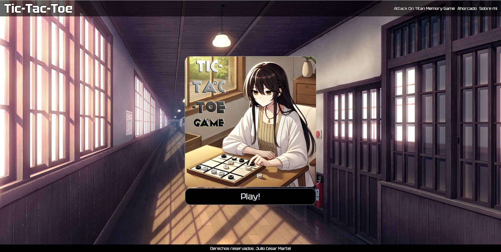
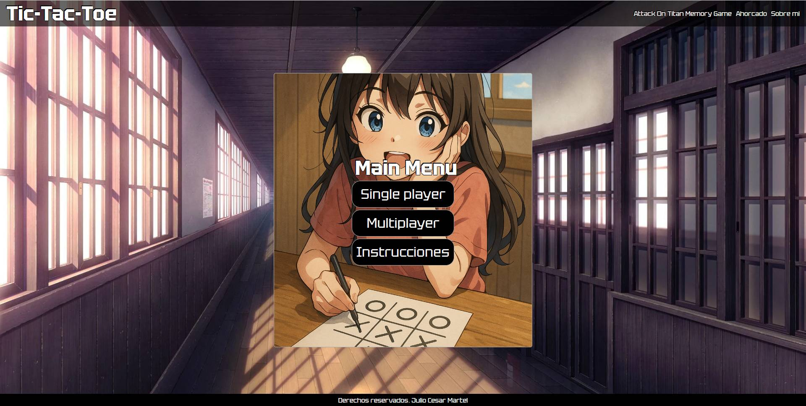
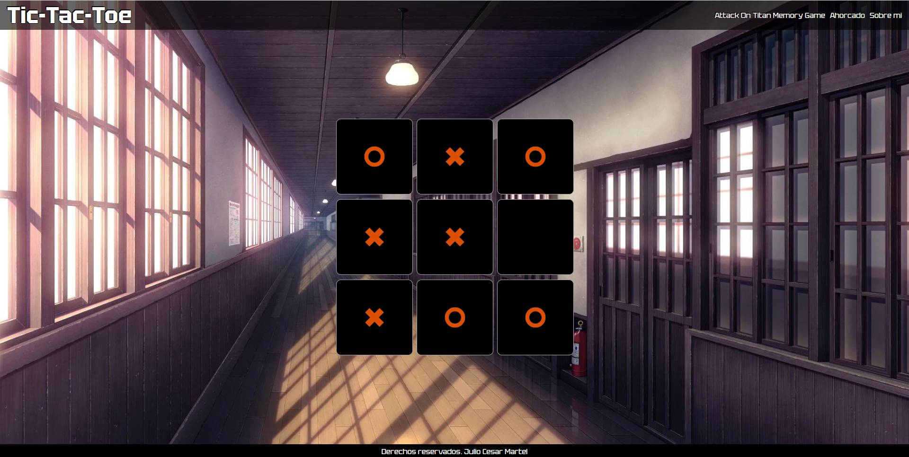

# tic-tac-toe
<h1>Juego de tres en linea</h1>

Pon a prueba tu lógica y estrategia en este juego de dos jugadores donde el objetivo es alinear tres símbolos iguales —ya sea en forma horizontal, vertical o diagonal— antes que tu oponente.
Desarrollado con HTML, CSS y JavaScript puro, este juego simple pero entretenido te garantiza unos minutos de diversión.

